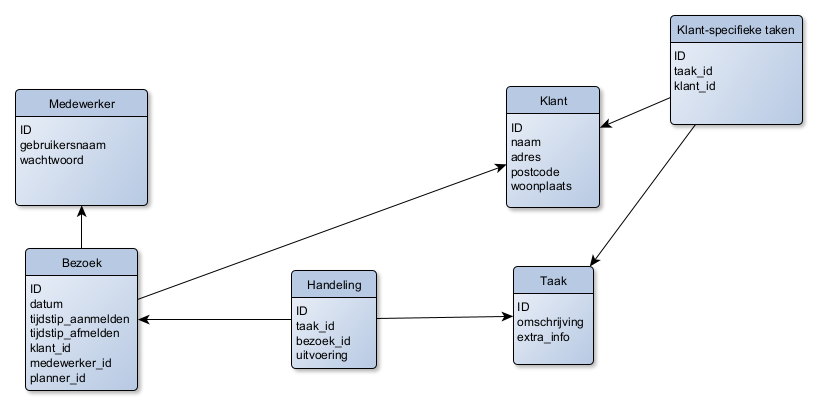
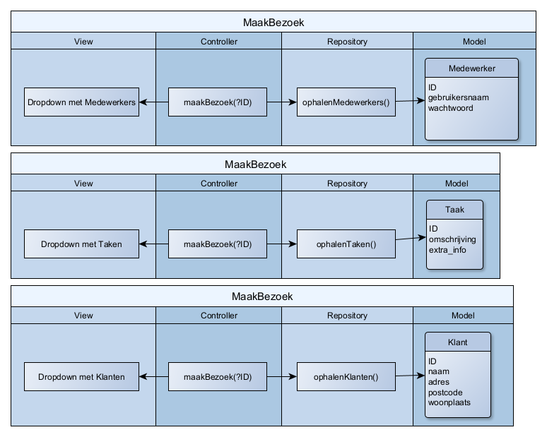
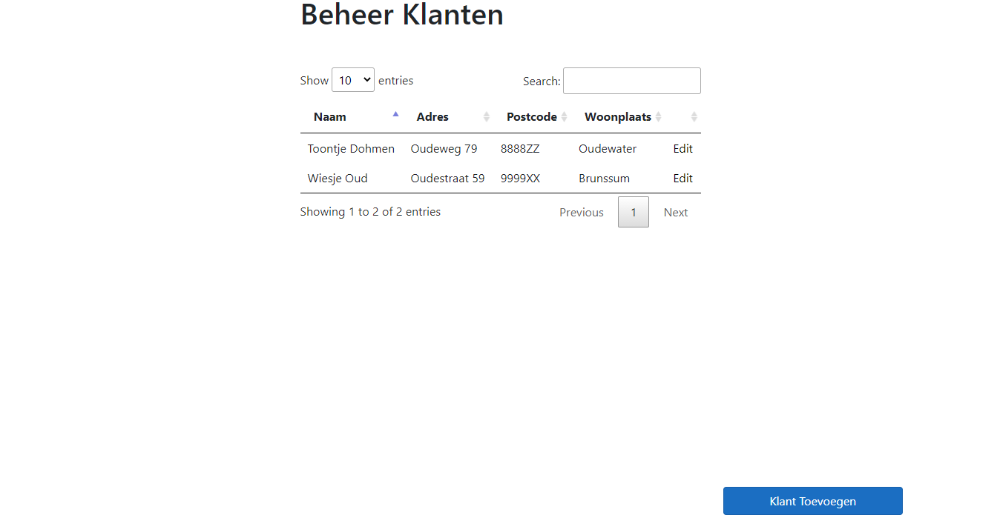
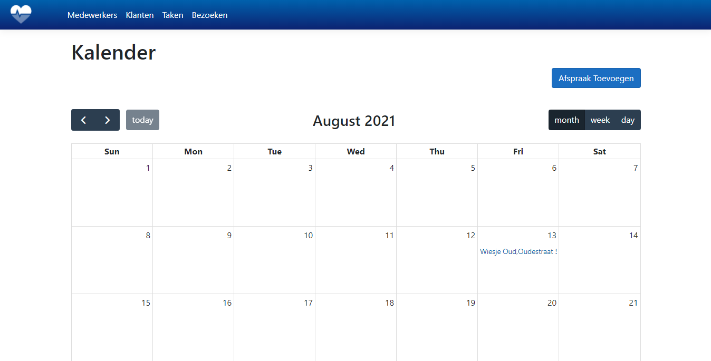

# Zapp de ZorgApp

De ZorgApp Zapp is een driedelige applicatie met als doel dat zorgmedewerkers efficiënt zorgtaken bij hun clienten kunnen verrichten. Het bestaat uit:
* Een Webapplicatie, waarin een planner bezoeken kan regelen tussen klant en medewerker met een bijbehorend takenpakket.
* Een Mobile app, waarin medewerkers kunnen zien welke bezoeken ze hebben voor die dag en welke handelingen ze moeten verrichten bij dat bezoek.
* Een API, die de communicatie regelt tussen de webapplicatie en de mobile app.

In de eerste twee weken ben ik bezig geweest met het inrichten van de webapplicatie. Uiteindelijk bleek MVC met repositories het juiste design pattern te zijn om te gebruiken hiervoor. Naast simpele CRUD functies zijn er voor twee pagina's wat ingewikkeldere functies bedacht om ze werkend te krijgen. Dit is uiteindelijk goed gelukt. 

## Structuur

---

De webapplicatie bestaat uit diverse pagina's, te weten:

* Inlogscherm.
* Beheer Klanten/Taken/Medewerkers overzicht.
* Bewerk Klant/Taak/Medewerker pagina.
* Bezoekenoverzicht.
* Bezoekdetailpagina.

---
---

## Technologieën

* Microsoft SQL Server
* C#
* Visual Studio
* ASP.NET Core
* Microsoft EntityFrameworkCore
* Bootstrap
* HTML
* CSS
* JavaScript
* JQuery
* Datatables
* FullCalendar
* TavoCalendar
* Design Pattern MVC

Met behulp van design pattern MVC en framework ASP.NET Core is de backoffice gebouwd. De repositories communiceren door middel van Microsoft EntityFramworkCore met de database. De controllers regelen de CRUD operaties van en naar de repositories en verpakken waar nodig de data in een ViewModel gemaakt voor een specifieke pagina. Dit is het geval voor de Edit Klant pagina en het bezoekdetailscherm. In de views wordt gebruikt gemaakt van tag helpers, @helpers, en html helpers voor de communicatie tussen frontend en backend.

## Methoden en Technieken

De entiteiten met PK's en FK relaties zijn hieronder te zien.


Er zijn ook ASD's gemaakt voor het backoffice deel. 
De ASD's van de Medewerkers en Taken zijn hetzelfde in structuur als de ASD voor de Klant.





# Webpagina's

---

## Inlogscherm


In het Inlogscherm kan de planner inloggen met zijn gebruikersnaam (email) en wachtwoord.

## Beheer Klanten/Taken/Medewerkers overzicht



Deze pagina's zijn simpele overzichten van de lijsten met Klanten/Taken/Medewerkers.

## Klant/Taak/Medewerker Toevoegen


Deze pagina's zijn simpele forms om een Klant/Taak/Medewerker toe te voegen.

## Bewerk Klant


De Bewerk Klantpagina laat naast de klantgegevens die aangepast en/of verwijderd kunnen worden, ook een lijst met klant-specifieke taken zien. Deze taken kunnen geselecteerd worden uit een algemene takenlijst. Ze kunnen hier vervolgens ook weer verwijderd worden.

## Bewerk Taak/Medewerker

Deze twee pagina's zijn simpele bewerkpagina's om taak- of medewerkergegevens aan te passen en/of te verwijderen. Deze zijn gelijk aan de Bewerk Klant pagina minus de 
tabel met klant-specifieke taken.

## Bezoekenoverzicht



Het bezoekenoverzicht bestaat uit een kalender met daarin bezoeken gepland die de klantgegevens tonen. Men kan op de link klikken om door te gaan naar het bezoekdetailscherm of men kan een nieuw bezoek plannen door op de knop 'Afspraak Toevoegen' te klikken.

## Bezoekdetailscherm


In het detailscherm kan de planning gemaakt, aangepast, verwijderd of bekeken worden. De planner kan hierin een datum prikken, een klant selecteren uit de klantenlijst en een medewerker selecteren uit de medewerkerslijst. Tevens kunnen handelingen toegevoegd en/of verwijderd worden. Dit kan ofwel door
* Een taak te kiezen uit de standaard takenlijst.
* Een klant te kiezen uit de standaard klantenlijst, waardoor de klant-specifieke taken automatisch toegevoegd worden aan de lijst met handelingen.

## API

De API zorgt voor de communicatie tussen Backoffice en de Mobiele app.
De taken van de API zijn als volgt:
* Updaten van de handelingen die afgevinkt zijn in de mobiele app door de medewerker.
* Updaten van het bezoek wat betreft de tijdstippen van aan- en afmelden door de medewerker in de mobiele app.
* Valideren van de medewerker die inlogt met gebruikersnaam en wachtwoord.
* Ophalen van het token dat bij de medewerker hoort en de volledige informatie inclusief bezoeken over de medewerker terugsturen.
* Valideren van de medewerker die de app start na het token ontvangen te hebben door middel van het Id en GUID.

Als men in Postman de gebruikersnaam en wachtwoord van de medewerker opstuurt in JSON formaat, gegeven door:
```JSON
{
    "id": 0,
    "gebruikersnaam": "Carla Peters",
    "wachtwoord": "$2a$11$zDrCKrGKNv8a.meF2rgW6uZtCEv7MyhGGZfx2WUpJyq4Z8u/r8M4e",
    "bezoeken": null
}
```
Dan stuurt de API vervolgens als antwoord:
```JSON
    {
    "id": 6,
    "guid": "57d71746-1ca0-41a2-bfc1-05a73bf76576",
    "gebruikersnaam": "Carla Peters",
    "wachtwoord": "$2a$11$zDrCKrGKNv8a.meF2rgW6uZtCEv7MyhGGZfx2WUpJyq4Z8u/r8M4e",
    "bezoeken": [
        {
            "id": 50,
            "datum": "2021-08-13T00:00:00",
            "tijdstip_aanmelden": "00:00:00",
            "tijdstip_afmelden": "00:00:00",
            "medewerkerId": 6,
            "klantId": 11,
            "klant": {
                "id": 11,
                "naam": "Toontje Dohmen",
                "adres": "Oudeweg 79",
                "postcode": "8888ZZ",
                "woonplaats": "Oudewater",
                "bezoeken": [],
                "ksTaken": null
            },
            "handelingen": [
                {
                    "id": 117,
                    "uitvoering": false,
                    "taakId": 1,
                    "bezoekId": 50,
                    "taak": {
                        "id": 1,
                        "omschrijving": "Koffie Zetten",
                        "extra_info": "Zwart",
                        "handelingen": [
                            {
                                "id": 118,
                                "uitvoering": false,
                                "taakId": 1,
                                "bezoekId": 50
                            }
                        ],
                        "ksTaken": null
                    }
                },
                {
                    "id": 118,
                    "uitvoering": false,
                    "taakId": 1,
                    "bezoekId": 50,
                    "taak": {
                        "id": 1,
                        "omschrijving": "Koffie Zetten",
                        "extra_info": "Zwart",
                        "handelingen": [
                            {
                                "id": 117,
                                "uitvoering": false,
                                "taakId": 1,
                                "bezoekId": 50
                            }
                        ],
                        "ksTaken": null
                    }
                }
            ]
        }
    ]
}
```
Hiermee wordt vervolgens aan de mobiele kant verder mee gewerkt.


